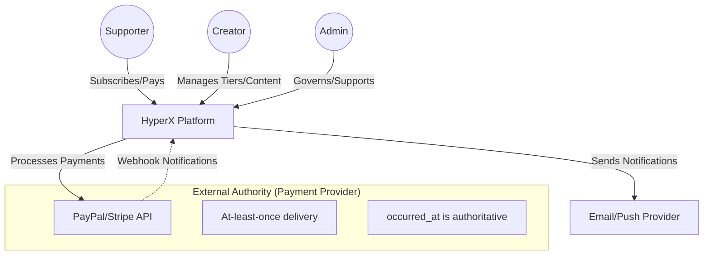
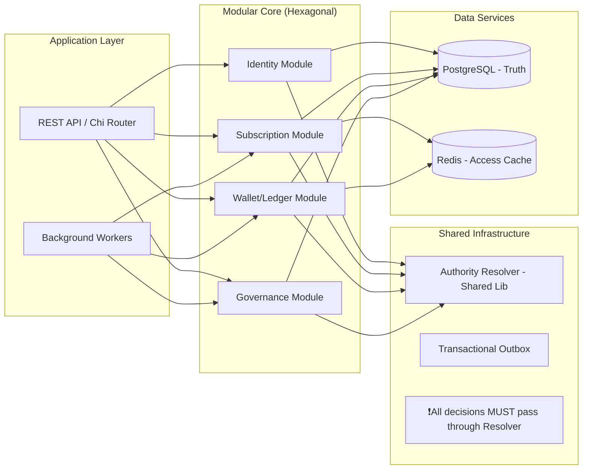
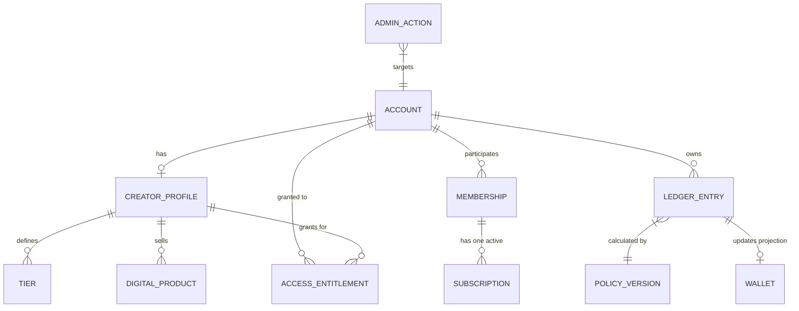
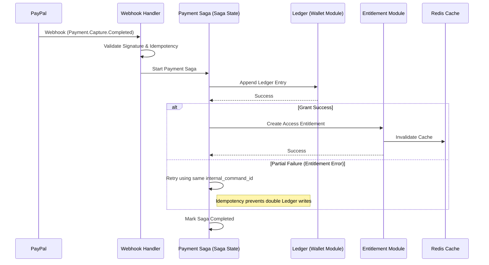
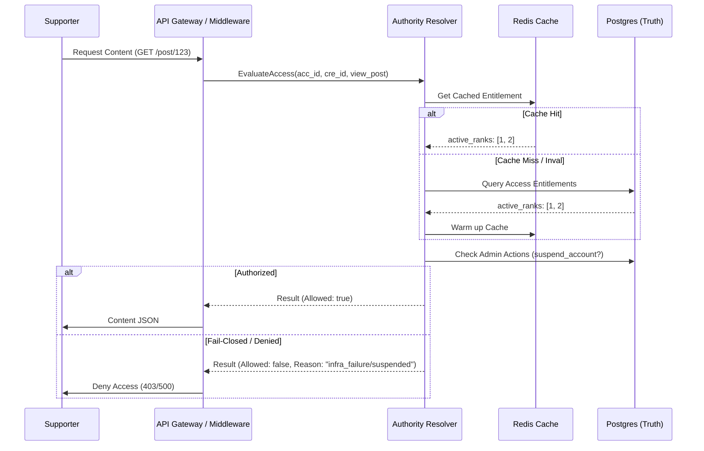
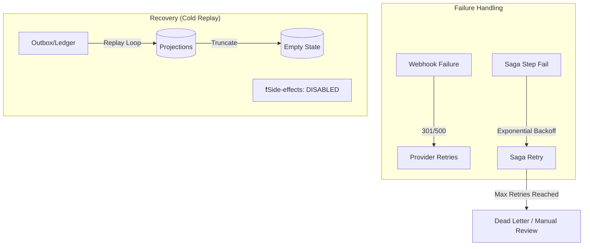
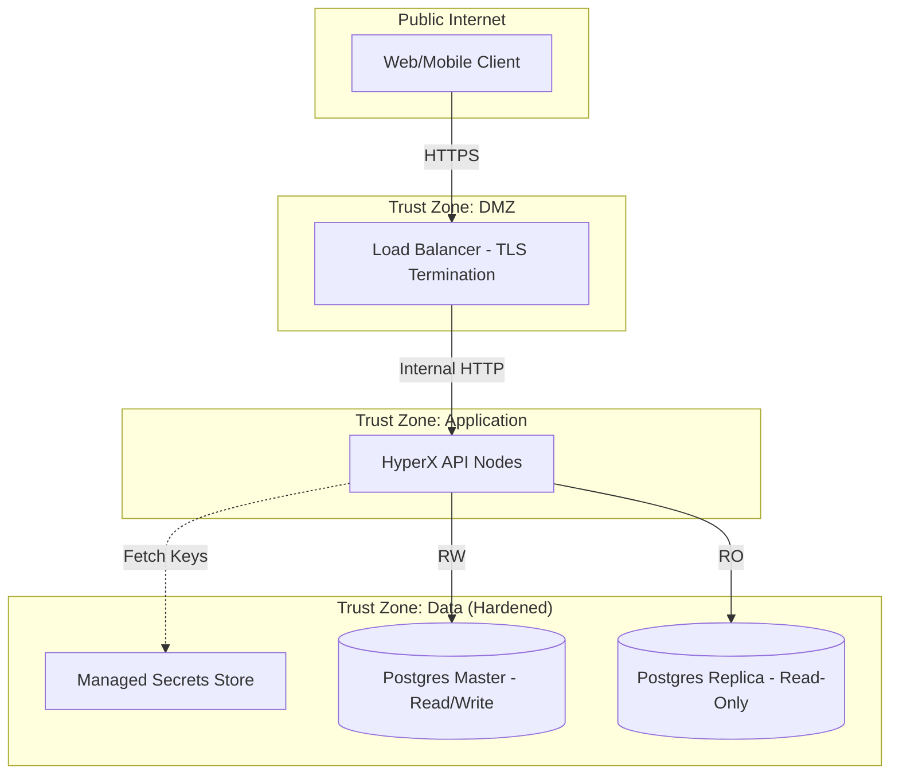
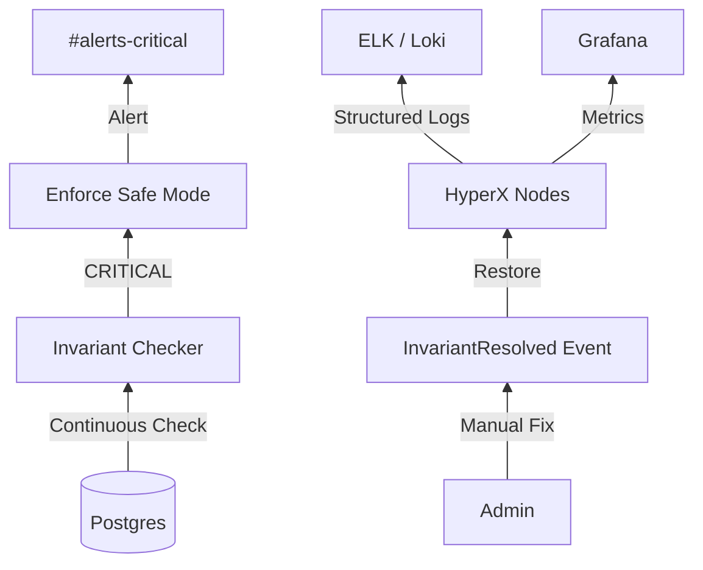
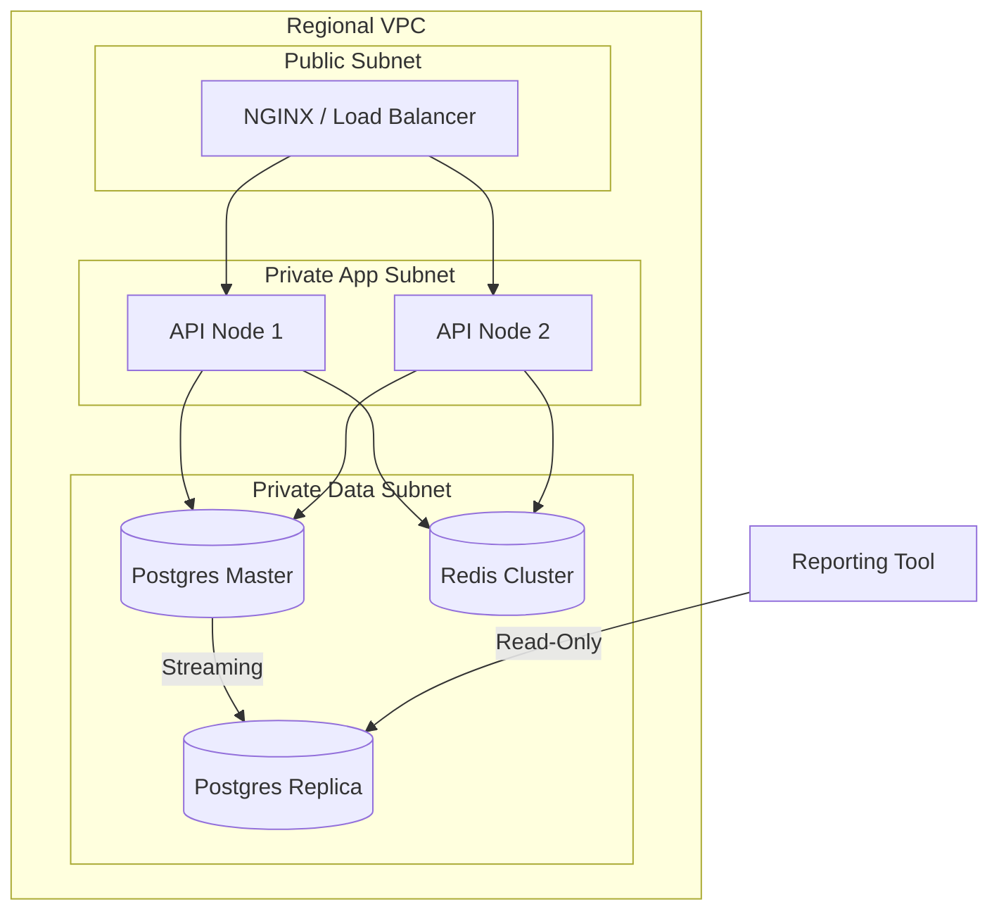

# Architecture Blueprint & Diagrams: HyperX
**Version:** 1.1.0
**Role:** Senior Solutions Architect
**Status:** Approved (Principal Engineer Hardened)

This document provides a comprehensive visual and structural guide for building, operating, and scaling the HyperX platform.

---

## 1. System Context Diagram
**Purpose:** Defines the boundaries of the system and its interactions with external actors.



**Notes:** 
- The system is centrally controlled but relies on External Authority for financial facts.
- **Constraint:** `occurred_at` from provider is the only authoritative time for financial logic.

---

## 2. High-Level Architecture (Modular Monolith)
**Purpose:** Shows internal organization and mandatory enforcement points.



---

## 3. Data Model (ERD)
**Purpose:** Defines the schema and relationships, emphasizing temporal truth.



**Design Notes:**
- **Temporal Truth:** All truth tables (Ledger, Entitlements, AdminActions) MUST carry authoritative `occurred_at_utc`.
- **Partitioning:** `ledger_entries` is monthly partitioned. `ledger_seq` (BigSerial) ensures total order.

---

## 4. AdminAction Lifecycle
**Purpose:** Visualizes the journey of a governance event from issuance to expiration/reversal.

```mermaid
stateDiagram-v2
    [*] --> Issued: Admin creates Action
    Issued --> Effective: effective_at reached
    Effective --> Active: Authority Resolver enforces
    Active --> Expired: expires_at reached
    Active --> Reversed: manual invalidated_at set
    Expired --> [*]
    Reversed --> [*]
    
    note right of Active
        Authority Resolver checks 
        Effective <= Now < Expires
    end
```

---

## 5. Sequence: Payment & Entitlement Flow (with Failure Path)
**Purpose:** Explains the journey from webhook to access, including retry logic.



---

## 6. Access Validation (Fast Path & Fail-Closed)
**Purpose:** Shows security enforcement with performance and safety fallbacks.



---

## 7. Failure & Recovery Flows (Saga & Replay)
**Purpose:** Shows how the system handles state corruption and recovery.



---

## 8. Security Architecture Diagram
**Purpose:** Defines encryption, secrets, and trust zones.



---

## 9. Operational & Observability Diagram
**Purpose:** Shows monitoring and the invariant resolution loop.



---

## 10. Deployment Diagram (Scaling)
**Purpose:** Physical infrastructure layout.


